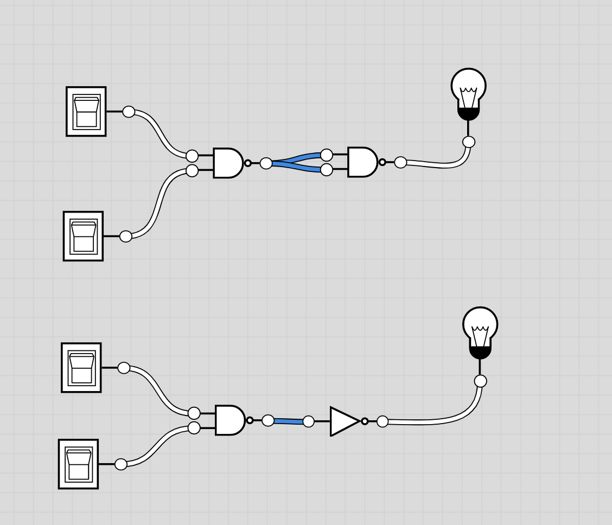

# And gate

Use Nand and then Not gate

| x   | y   | x Nand y | ~ (x Nand y) = x AND y |
| --- | --- | -------- | ---------------------- |     
| 0   | 0   | 1        | 0                      |
| 0   | 1   | 1        | 0                      |
| 1   | 0   | 1        | 0                      |
| 1   | 1   | 0        | 1                      |

