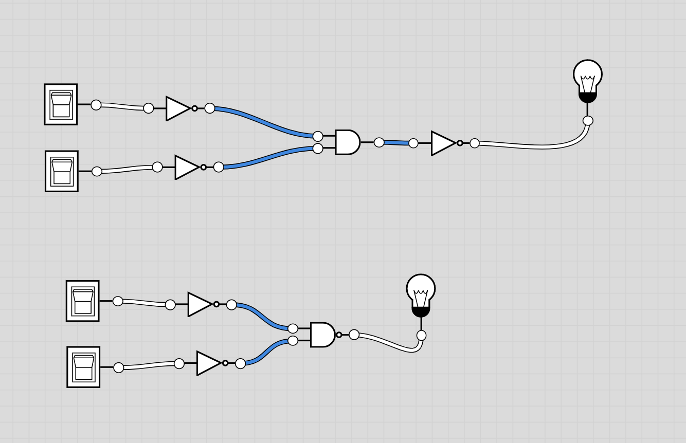

# Or gate

This gate can be implemented using Not and And and the [De Morgan laws](https://en.wikipedia.org/wiki/De_Morgan%27s_laws)

De Morgan Law:

```(expression)
not (A or B) = (not A) and (not B)
```

Then:

```
A or B = not (not (A or B))
A or B = not ((not A) and (not B))
A or B = (not A) nand (not B)
```


| x   | y   | not x |  not y | (not x) nand (not b) == x or y |
| --- | --- | ----- | ------ | ------------------------------ |
| 0   | 0   | 1     | 1      | 0                              |
| 0   | 1   | 1     | 0      | 1                              |
| 1   | 0   | 0     | 1      | 1                              |
| 1   | 1   | 0     | 0      | 1                              |


