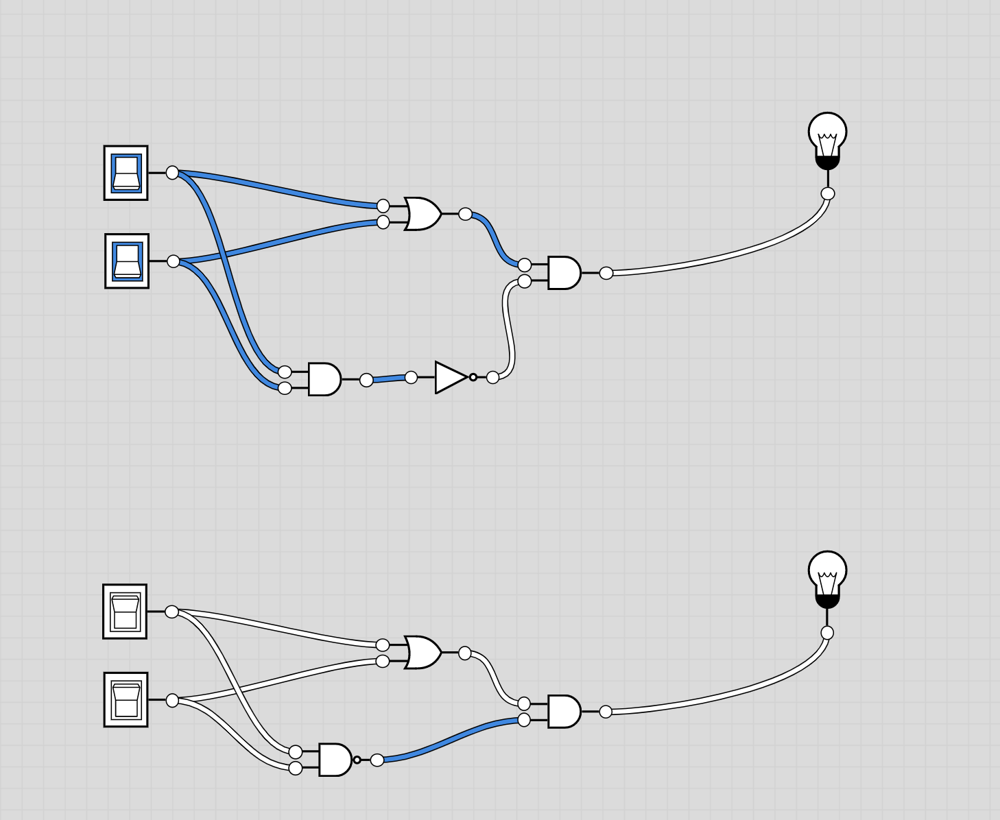

# Xor gate

Xor truth table is:

| a   | b   | xor |
| --- | --- | --- |
| 0   | 0   | 0   |
| 0   | 1   | 1   |   
| 1   | 0   | 1   | 
| 1   | 1   | 0   |   


Xor is true in the following cases:
- not a and b
- a and not b

```
(not a and b) or (a and not b)
```

Simplifying the expression

```
((not a and b) or a) and ((not a and b) or not b)
((not a or a) and (b or a))  and ((not a or not b) and (b or not b))
(true and (b or a)) and ((not a or not b) and true)
(b or a) and (not a or not b)
(b or a) and not(a and b)
(b or a) and (a nand b)
```

